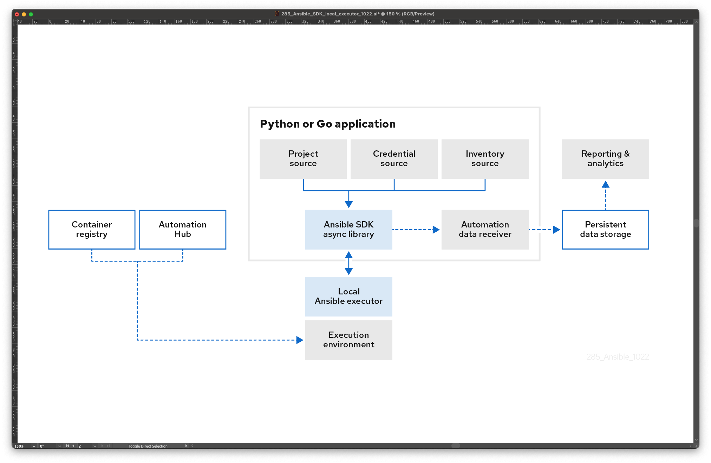

.. _intro:

Ansible SDK
===========

Ansible SDK is a lightweight Python library that lets you dispatch and monitor Ansible tasks, roles, and playbooks from your projects.

As a programmatic interface to Ansible, the SDK lets you:

* Access and control Ansible operations.
* Marshall parameters for operations to different formats.
* Pass data in native Python structures to and from Ansible.

You can execute Ansible content with the SDK in any combination of local or remote subprocesses with or without containerization.

SDK architecture
----------------

As the preceding diagram illustrates, you add the Ansible SDK to your Python application and provide the following:

Project
    Logical collection of Ansible playbooks, credentials, and inventories.
Credentials
    Authentication with host systems.
Inventory
    List of host systems on which automation jobs run.

Ansible SDK takes these inputs then makes multi-threaded, asynchronous calls to the local Ansible executor.
The local Ansible executor is the runtime on the application host.
It pulls execution environments, which are container images packaged with all dependencies, to perform automation runs based on the project, credentials, and inventory.

For each automation run, the local Ansible executor returns status to Ansible SDK.
Ansible SDK then passes metrics to the Automation data receiver for reporting and analytics purposes.
