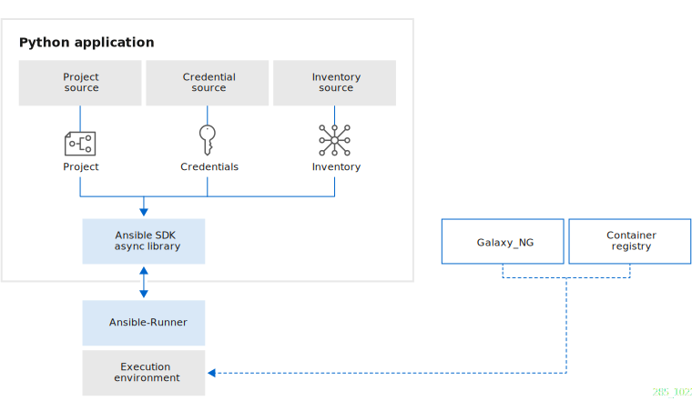
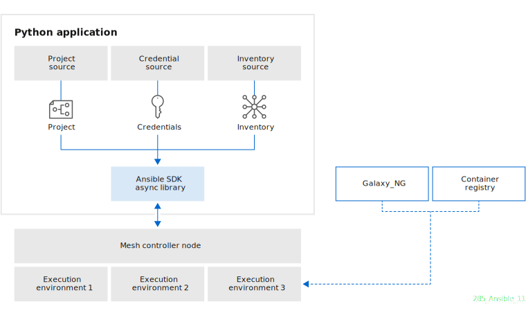

.. _intro:

Ansible SDK
===========

Ansible SDK is a lightweight Python library that lets you dispatch and monitor Ansible tasks, roles, and playbooks from your projects.

As a programmatic interface to Ansible, the SDK lets you:

* Access and control Ansible operations.
* Marshall parameters for operations to different formats.
* Pass data in native Python structures to and from Ansible.

SDK architecture
----------------

Ansible SDK runs in your Python application and takes the following inputs:

Project
    Logical collection of Ansible playbooks, credentials, and inventories.
Credentials
    Authentication with host systems.
Inventory
    List of host systems on which automation jobs run.

With those inputs, Ansible SDK makes asynchronous calls to perform automation runs against your project payload.
You can execute Ansible content with the SDK in any combination of local or remote subprocesses.
You can also use execution environments, which are container images packaged with all dependencies.

Local execution
***************

Ansible SDK calls the local Ansible executor to perform automation runs.
The local Ansible executor is the runtime on the application host that pulls execution environments, runs your automation jobs, and returns status to Ansible SDK.

Remote execution
****************

Ansible SDK calls the Automation mesh controller node to perform automation runs.
The controller node runs your automation jobs on remote execution environments and returns status to Ansible SDK.

